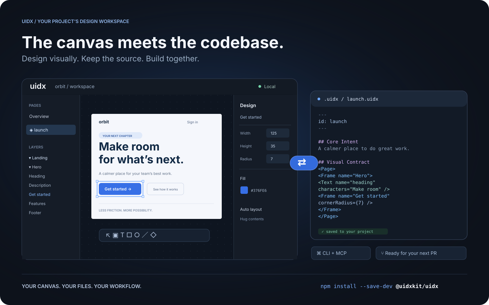

<p align="center"></p>
<h1 align="center">Design in your repo.</h1>
<p align="center">A visual design workspace for your project.<br />Editable on a canvas. Readable by people and agents. Versioned with your code.</p>
<p align="center">
  <a href="https://github.com/uidxkit/uidx/actions/workflows/ci.yml"></a>
  <a href="LICENSE"></a>
  <a href="#install"></a>
</p>



*Workflow illustration: one design, shared by the canvas, your files, and your tools.*

## What is UIDX?

UIDX brings a design canvas into your application's repository. Install
`@uidxkit/uidx` as a **local development dependency**, run `npm run uidx`, and
work on designs stored in your project's `.uidx/` folder.

A `.uidx` file combines Markdown describing a design's purpose with a declarative
node tree describing its appearance. Edit the canvas and the file updates. Edit
the file and the canvas follows. Changes produce focused text diffs you can
review in a pull request.

- **A visual workspace.** Create pages, draw shapes, edit text, and adjust layout
  and styling from the canvas and inspector.
- **Reusable design systems.** Components, instances, variants, slots, and design
  tokens share a document namespace.
- **Your project owns the files.** Keep designs, assets, and fonts next to your
  application and version them with Git.
- **A shared workflow for people and agents.** The CLI and MCP bridge let external
  tools inspect and edit the same files the viewer uses.
- **Local by default.** The viewer and project server run on your machine. Canvas
  synchronization does not require an LLM or a hosted design service.

UIDX is an early release. The file format and APIs may change
before 1.0. It is a design workspace; it does not render your application's
existing UI components as Storybook stories.

## Install

Requires **Node.js 22.19 or newer**. Node 24 is recommended.

Run these commands **inside your application's repository**:

```sh
npm install --save-dev @uidxkit/uidx
npm run uidx
```

Installation adds the `uidx` and `uidx:mcp` scripts and creates `.uidx/` when it
doesn't exist. Existing scripts, configuration, and designs are preserved.
The CLI, server, viewer, WASM, and bundled fonts live in your project's
`node_modules`; a global UIDX installation is not required.

Recent npm versions do not run a package's install script until you approve
it, and warn with `install scripts not yet covered by allowScripts`. Nothing is
lost: the first `npx uidx dev` performs the same setup itself and says so, or
approve the script with `npm install-scripts approve @uidxkit/uidx` and
reinstall. To set up explicitly, run `npx --no-install uidx init`. If your
project already uses a script named `uidx`, choose another with
`npx --no-install uidx init --script design`, then run `npm run design`.

## Your design workspace

```text
your-project/
├── package.json          # @uidxkit/uidx devDependency and npm scripts
├── .mcp.json             # connection for MCP clients
├── src/
└── .uidx/
    ├── config.json       # project settings
    ├── uidx.json         # document name, page patterns, and asset patterns
    ├── welcome.uidx      # initial page for a new workspace
    ├── assets/
    └── fonts/
```

Open the viewer, click **New page**, give it a name, and start designing. New
pages are saved in your design folder and appear in the overview. Commit your
project's `.uidx/` files alongside application code.

### Configuration

Set the shared viewer and MCP port in `.uidx/config.json`:

```json
{
  "port": 4400
}
```

Restart `npm run uidx` after changing it. Use `npm run uidx -- --port 4500` for a
one-time override. If the requested port is busy, UIDX tries the next available
one and reports its actual address. Configuration currently uses JSON.

The separate `.uidx/uidx.json` manifest controls which files belong to the document:

```json
{
  "id": "my-project",
  "files": ["**/*.uidx"],
  "assets": ["assets/**"]
}
```

### CLI and MCP

`npm run uidx` starts the local viewer, file synchronization server, and MCP HTTP
endpoint on one port. MCP clients use the generated `.mcp.json` to launch
`npm run --silent uidx:mcp`, a stdio bridge to that running project server.

```sh
npx --no-install uidx status
npx --no-install uidx check
npx --no-install uidx fmt --check
```

The CLI also supports reading, creating, editing, and rendering pages. See the
[CLI guide](packages/cli/README.md) and [agent architecture](packages/agent/README.md).

## Documentation

- [Drawing icons and custom graphics](docs/graphics-tools.md)
- [Fonts](docs/fonts.md)
- [Property vocabulary](docs/property-vocabulary.md)
- [Architecture decisions](docs/decisions)
- [Release guide](docs/releasing.md)
- [Changelog](CHANGELOG.md)

## Contributing and license

Bug reports, documentation improvements, and pull requests are welcome.
See [Contributing](CONTRIBUTING.md) for development setup and checks.
Follow the [Code of Conduct](CODE_OF_CONDUCT.md) and report vulnerabilities through
the [security policy](SECURITY.md). Changes to `main` are merged by the owner.

UIDX is [MIT licensed](LICENSE). Third-party code and fonts retain their
[respective licenses](THIRD_PARTY_NOTICES.md).
