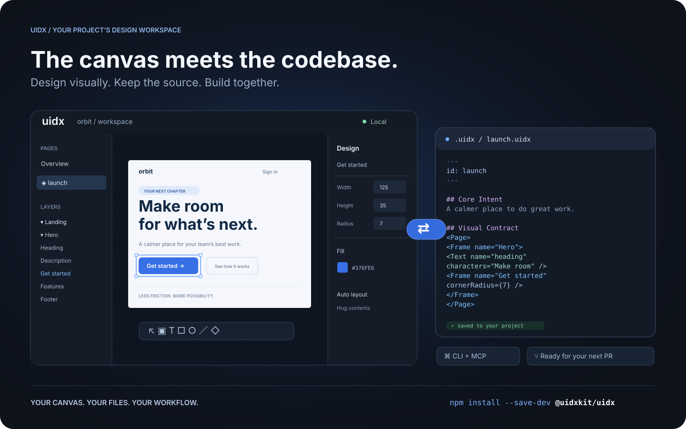

<p align="center"></p>
<h1 align="center">Design in your repo.</h1>
<p align="center">A visual design workspace for your project.<br />Editable on a canvas. Readable by people and agents. Versioned with your code.</p>
<p align="center">
  <a href="https://github.com/uidxkit/uidx/actions/workflows/ci.yml"></a>
  <a href="LICENSE"></a>
  <a href="#install"></a>
</p>



*Workflow illustration: one design, shared by the canvas, your files, and your tools.*

## What is UIDX?

UIDX brings a design canvas into your application's repository. Install
`@uidxkit/uidx` as a **local development dependency**, run `npm run uidx`, and
work on designs stored in your project's `.uidx/` folder.

A `.uidx` file combines Markdown describing a design's purpose with a declarative
node tree describing its appearance. Edit the canvas and the file updates. Edit
the file and the canvas follows. Changes produce focused text diffs you can
review in a pull request.

- **A visual workspace.** Create pages, draw shapes, edit text, and adjust layout
  and styling from the canvas and inspector.
- **Reusable design systems.** Components, instances, variants, slots, and design
  tokens share a document namespace.
- **Your project owns the files.** Keep designs, assets, and fonts next to your
  application and version them with Git.
- **A shared workflow for people and agents.** The CLI and MCP bridge let external
  tools inspect and edit the same files the viewer uses.
- **Local by default.** The viewer and project server run on your machine. Canvas
  synchronization does not require an LLM or a hosted design service.

UIDX is an early release. The file format and APIs may change
before 1.0. It is a design workspace; it does not render your application's
existing UI components as Storybook stories.

## Install

Requires **Node.js 22.19 or newer**. Node 24 is recommended.

Run these commands **inside your application's repository**:

```sh
npm install --save-dev @uidxkit/uidx
npm run uidx
```

Installation adds the `uidx` and `uidx:mcp` scripts and creates `.uidx/` when it
doesn't exist. Existing scripts, configuration, and designs are preserved.
The CLI, server, viewer, WASM, and bundled fonts live in your project's
`node_modules`; a global UIDX installation is not required.

Recent npm versions do not run a package's install script until you approve
it, and warn with `install scripts not yet covered by allowScripts`. Nothing is
lost: the first `npx uidx dev` performs the same setup itself and says so, or
approve the script with `npm install-scripts approve @uidxkit/uidx` and
reinstall. To set up explicitly, run `npx --no-install uidx init`. If your
project already uses a script named `uidx`, choose another with
`npx --no-install uidx init --script design`, then run `npm run design`.

## Your design workspace

```text
your-project/
├── package.json          # @uidxkit/uidx devDependency and npm scripts
├── .mcp.json             # connection for MCP clients
├── src/
└── .uidx/
    ├── config.json       # project settings
    ├── uidx.json         # document name, page patterns, and asset patterns
    ├── welcome.uidx      # initial page for a new workspace
    ├── assets/
    └── fonts/
```

Open the viewer, click **New page**, give it a name, and start designing. New
pages are saved in your design folder and appear in the overview. Commit your
project's `.uidx/` files alongside application code.

### Configuration

Set the shared viewer and MCP port in `.uidx/config.json`:

```json
{
  "port": 4400
}
```

Restart `npm run uidx` after changing it. Use `npm run uidx -- --port 4500` for a
one-time override. If the requested port is busy, UIDX tries the next available
one and reports its actual address. Configuration currently uses JSON.

The separate `.uidx/uidx.json` manifest controls which files belong to the document:

```json
{
  "id": "my-project",
  "files": ["**/*.uidx"],
  "assets": ["assets/**"],
  "headless": "../vendor/hwc/custom-elements.json"
}
```

`headless` is optional. It names the headless library's `custom-elements.json`,
relative to `uidx.json`; with it, the viewer's Contract tab offers the library's
elements and parts as choices, and `uidx codegen` checks contracts against it.
Leave it out and the Contract tab offers the libraries your dependencies ship
(any package whose `package.json` has a `customElements` field) and writes your
choice here. The object form binds the same designs to a library that spells
things differently, without editing a design:

```json
{
  "headless": {
    "manifest": "node_modules/@shoelace-style/shoelace/dist/custom-elements.json",
    "profile": { "props": "attribute", "customStates": "state", "parts": "element" },
    "bindings": {
      "Checkbox": {
        "tag": "sl-checkbox",
        "parts": { "checked-indicator": "control" },
        "events": { "change": "sl-change" }
      }
    }
  }
}
```

`profile` says how the library reflects props (`attribute`, `data-attribute`,
`class`), its own states (`state`, `data-attribute`, `class`) and parts
(`element`, `data-part`). `bindings` maps a component's identity names to the
library's. Both default to the conventions `@hwc/components` follows.

`codegen` is optional too: `{ "out": "../generated", "targets": ["html", "react", "contract"] }`
says where `uidx codegen` writes without `--out`, and gives the viewer's
Contract tab a Generate button that renders the same output from the server.

### CLI and MCP

`npm run uidx` starts the local viewer, file synchronization server, and MCP HTTP
endpoint on one port. MCP clients use the generated `.mcp.json` to launch
`npm run --silent uidx:mcp`, a stdio bridge to that running project server.

```sh
npx --no-install uidx status
npx --no-install uidx check
npx --no-install uidx fmt --check
```

The CLI also supports reading, creating, editing, and rendering pages. See the
[CLI guide](packages/cli/README.md) and [agent architecture](packages/agent/README.md).

## Design system: one file, every render

A `.uidx` file can be the identity of a component, and the components you
ship — on the canvas, in Figma, as HTML/CSS, as React — are renders of it
(ADRs 0012–0017). Nothing in the file computes; implementation is a renderer's
job. One checkbox, top to bottom:

```mdx
---
id: checkbox
---

Lets a user toggle one option. The box and its marks are the design system's;
the label comes from a Field.

## Visual Contract

<Page>
  <Component name="Checkbox" status="stable" implements="hwc-checkbox"
    width={20} height={20} cornerRadius="{radius#sm}" fills="{surface#control}">
    <Vector name="check" part="checked-indicator" visible={false} width={12} height={12} … />
  </Component>
</Page>

<Styles>
  <Style state="checked" root:fills="{surface#accent}" checked-indicator:visible={true} />
  <Style state="hover" root:strokes="{border#hover}" />
  <Style state="disabled" root:opacity="{opacity#disabled}" />
</Styles>

## Contract

<Props>
  <Prop name="checked" type="boolean" default={false} controllable visual>Whether the option is selected.</Prop>
  <Prop name="disabled" type="boolean" default={false} visual>Inert and dimmed.</Prop>
</Props>
<Events>
  <Event name="change" detail="{ checked: boolean }">Fires once per user toggle, never when set from code.</Event>
</Events>
<Accessibility role="checkbox" keyboard="Space toggles" />

## Behavior

- toggle: click or Space flips `checked`.
- change-event: `change` fires once per user toggle, never when `checked` is set from code.
```

- **Identity.** The visual contract is the anatomy and layout, in Figma's
  vocabulary. `implements` binds the component to a headless element,
  `part` binds a layer to one of its parts.
- **States.** A visual boolean prop is a state; `hover`, `focus` and `active`
  are the browser's and need no declaration. The styles table gives each
  state its look, and the canvas draws the whole set. Select a state on the
  canvas and change it: the viewer writes the row.
- **Contract.** What the code render exposes, every declaration with its
  words. The inspector's Contract tab binds components and parts to the
  library named in `uidx.json`, and edits the contract in place.
- **Behaviour.** Short bullets that guide the logic without being code.
- **Models.** For a list, a view model of what each row receives — declared
  once, named by a prop's type, sampled for the canvas, never derived. Any
  layer repeats over a list with `repeat="{items}"`; nested, that is a tree.

Then `uidx check` audits the regions against the tree, and `uidx codegen`
renders HTML/CSS and React over the headless library, checking each contract
against its `custom-elements.json`. See `examples/design-system` for six
components rendered end to end over `@hwc/components`.

## Documentation

- [Drawing icons and custom graphics](docs/graphics-tools.md)
- [Fonts](docs/fonts.md)
- [Property vocabulary](docs/property-vocabulary.md)
- [Architecture decisions](docs/decisions)
- [Release guide](docs/releasing.md)
- [Changelog](CHANGELOG.md)

## Contributing and license

Bug reports, documentation improvements, and pull requests are welcome.
See [Contributing](CONTRIBUTING.md) for development setup and checks.
Follow the [Code of Conduct](CODE_OF_CONDUCT.md) and report vulnerabilities through
the [security policy](SECURITY.md). Changes to `main` are merged by the owner.

UIDX is [MIT licensed](LICENSE). Third-party code and fonts retain their
[respective licenses](THIRD_PARTY_NOTICES.md).
